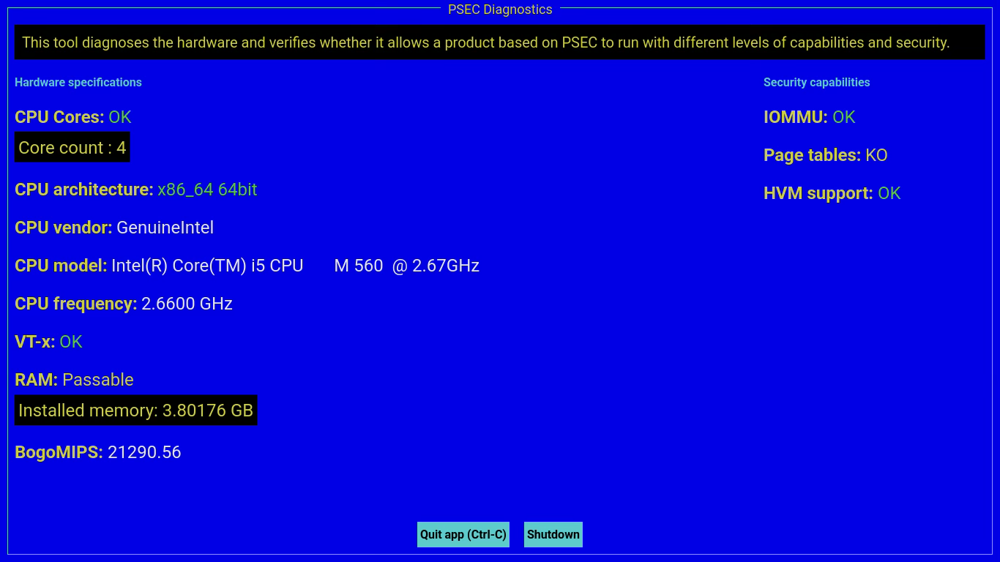

# Safecor Diag

Safecor Diagnostic tool is a simple way of veryfing that a platform can run a product based on Safecor and evaluate the level of security offered.

You can create an USB disk and use it on multiple platforms to verify their capacity.

> ⚠️ **Notice**
>
> The platform virtualization and security capabilities depend on the settings of the BIOS or EFI. Please adapt the settings to enable VT-d/AMD-Vi (or IOMMU) and VT-x/AMD-V.

## Screenshot

## Create a USB disk (x86 only)

- Download the image file [safecor-diag-x86_64.iso](https://www.alefbet.net/github/safecor/iso/safecor-diag-x86_64.iso).
- Format a USB disk in FAT.
- Use a software like `Rufus` or `dd` to put the image on the disk.
- Boot on the USB disk